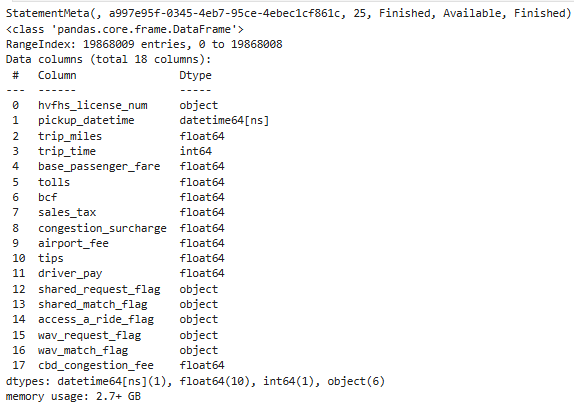
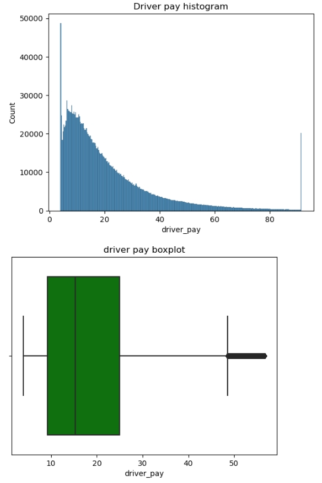
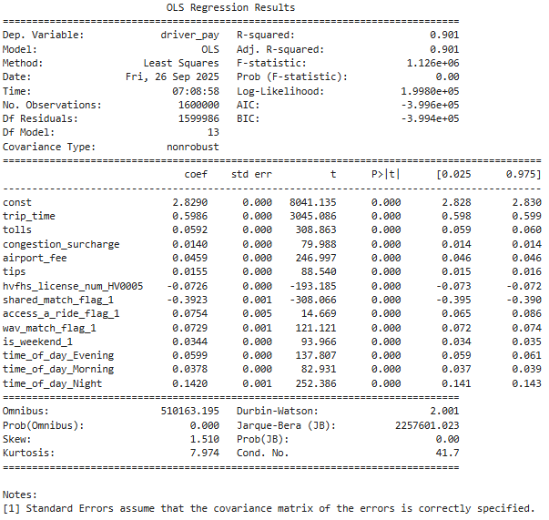
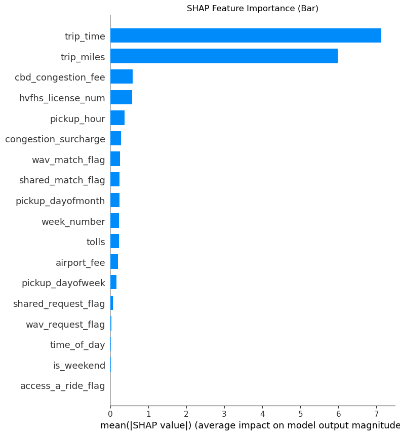
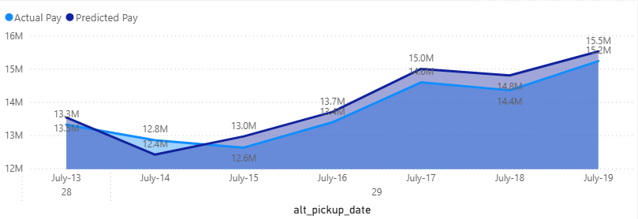
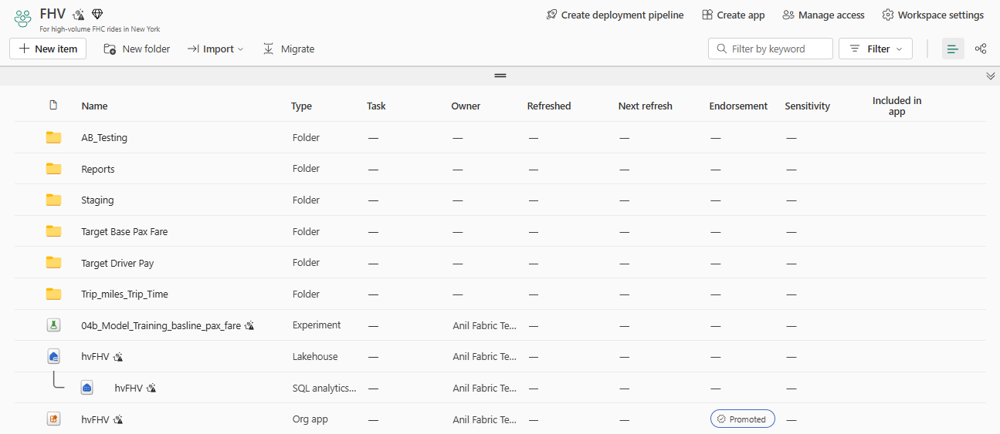

# 🚖 Predicting Driver Pay for High-Volume NYC Taxi Trips  
*From Exploratory Analysis to Predictive Modeling*  

[]()  
[]()  
[]()  

---

## 📑 Table of Contents  
- 🎯 Executive Summary  
- 📊 Key Results at a Glance  
- 💼 Business Value & Use Cases  
- 🔍 Data Loading & Staging Highlights  
- 🔍 EDA & Feature Engineering Highlights  
- 📈 Linear Regression (OLS) Model  
- 🌲 LightGBM Model & SHAP Explainability  
- 🧪 Predictions on New July 2025 Data  
- 🍪 Caveats & Feature Selection  
- 🏗️ Fabric Environment & Setup  
- 🚀 Recommendations & Next Steps  
- 🗂️ Repo Layout & How to Reproduce  
- 🏗️ Fabric Capacity Folder Views
- 🗂️ Documentation
- ✨ Closing Thoughts  

---

## 🎯 Executive Summary  
This repository presents an **end-to-end ML workflow** to predict **driver pay** for high-volume NYC taxi trips.  

- **Business case:** Forecast payouts & optimize fleet allocation in near-real time.  
- **Technical case:** Robust workflow: Data Ingestion → EDA → Feature Engineering → Model Training → Predictions.  
- **Investor case:** Demonstrates predictive intelligence for driver economics — a critical lever in the multi-billion-dollar mobility industry.  

#### *ML Workflow* 


---

## 📊 Key Results at a Glance  

| Stage | Model | MAE | RMSE | R² | Source |
|---|---:|---:|---:|---:|---|
| Training | Linear Regression (OLS) | 0.16 | 0.21 | **0.90** | Notebooks |
| Predictions (June sample) | Linear Regression | 0.16 | 0.21 | **0.90** | Notebooks |
| Training | LightGBM | 1.56 | 3.41 | **0.968** | Notebooks |
| Predictions (June sample) | LightGBM | 1.44 | 3.81 | **0.96** | Notebooks |
| Predictions (July full month) | LightGBM | 1.44 | 3.81 | **0.96** | Notebooks |

---

## 💼 Business Value & Use Cases  
- **Operational forecasting:** Predict payouts & adjust driver allocation.  
- **Pricing strategy:** Guide commissions and incentive design.  
- **Fraud detection:** Identify anomalous trips or payments.  
- **Investor story:** Production-grade ML with measurable ROI.  

---

## 🔍 Data Loading & Staging Highlights  
- **Source:** NYC FHV high-volume trip records (~19.8M rows per month).  
- **June 2025 sample:** ~2M trips for model training.  
- **July 2025 full month:** ~19.6M raw rows → ~2.5M scored after cleaning.  
- **Platform:** Microsoft Fabric Lakehouse, staged as CSV and parquet files.  
- **Quality checks:** Schema validation, invalid row removal (`driver_pay <= 0`, `base_passenger_fare <= 0`).  

#### *Initial Data Summary for July 2025*



---

## 🔍 EDA & Feature Engineering Highlights  
- **Distributions:** `driver_pay` right-skewed; short low-pay trips dominate, few long outliers.  
- **Correlations:** Strong ties between pay, trip time, distance, and base fare.  
- **Feature Engineering:**  
  - Cyclical encodings: pickup hour & weekday  
  - Log transforms: distance & trip time  
  - Outlier removal: trips >50 miles or >2 hours  
  - Categorical encoding: vendors, pickup/drop zones  
- **Result:** Gaussian-like distributions and improved correlation alignment with target variable.  

#### *Driver Pay Distributions*


#### *Correlations Heat Map*


---

## 📈 Linear Regression (OLS) Model  
- **Setup:** Log-transformed target (`driver_pay`).  
- **Feature selection:** Dropped post-trip revenue fields (`base_passenger_fare`, `tips`, `sales_tax`) to enable **pre-trip prediction**.  
- **Performance:**  
  - R² = 0.90  
  - MAE = 0.16  
  - RMSE = 0.21 (log scale)  
- **Value:** Transparent, interpretable baseline for business teams.  

#### *Model Summary* 


---

## 🌲 LightGBM Model & SHAP Explainability  
- **Performance:**  
  - Training RMSE ≈ 3.41, R² = 0.968  
  - New-data RMSE ≈ 3.81, R² = 0.96  
- **Feature importance (SHAP):**  
  - **Trip time:** primary driver of pay  
  - **Pickup zone:** reflects fare demand variability  
  - **Congestion surcharge:** increases predictions  
  - **Day-of-week:** weekends/peaks increase pay  
  - **Shared rides:** reduce predicted pay  
- **Value:** Non-linear model with strong predictive power & explainability.  

#### *SHAP Feature Importance* 


---

## 🧪 Predictions on New July 2025 Data  
- **Rows scored:** ~2.54M after cleaning  
- **Metrics consistent with validation:**  
  - MAE ≈ 1.44 USD  
  - RMSE ≈ 3.81 USD  
  - R² ≈ 0.96  
- **Business interpretation:** Predictions within ~$3.80 of actual pay on average.  

#### *Predicted vs. Actual* 



---

## 🍪 Caveats & Feature Selection  
- Linear regression metrics are log-transformed; interpret carefully.  
- LightGBM metrics are in USD — directly actionable.  
- Excluded features: base fares, tips, sales tax — ensures realistic **pre-trip prediction**.  

---

## 🏗️ Fabric Environment & Setup  
Built entirely on **Microsoft Fabric trial capacity**.  

**Setup Steps:**  
1. Sign up: [https://fabric.microsoft.com](https://fabric.microsoft.com)  
2. Create workspace, enable Data Science experience  
3. Upload notebooks, run sequentially (`01_...` → `04a_...`)  

**Dependencies:** Python 3.9+, Pandas, NumPy, scikit-learn, LightGBM  

#### *Fabric Workspace* 


---

## 🚀 Recommendations & Next Steps  
1. Evaluate inverse-transformed OLS predictions for comparability  
2. Extend SHAP explainability with interaction effects  
3. Deploy LightGBM model via **FastAPI** for real-time scoring  
4. Implement drift monitoring and error-tracking dashboards in Fabric  
5. Develop one-page **investor pitch** linking model performance to business ROI  

---

## 🗂️ Repo Layout & How to Reproduce  

```text
├── README.md
├── docs/
│   ├── Configuration.md
│   ├── PRESENTATION.md
│   └── Requirements.txt
├── images/                    # All image files linked in README & presentation
├── powerbi/                   # PDF exports of Power BI reports
├── sample_data/               # CSVs: source, training, modeled, predictions
├── notebooks/                 # Python notebooks saved as .html

Setup: 

git clone https://github.com/<your-username>/<your-repo>.git
cd <your-repo>
python -m venv venv
source venv/bin/activate   # macOS/Linux
venv\Scripts\activate      # Windows
pip install -r docs/Requirements.txt
```
---

## 🏗️ Fabric Capacity Folder Views

```
FabricWorkspace/
├── Tables/
│   ├── dbo/
│   │       ├── final_df
│   │       ├──final_dflgbm
│   │       ├──trained_final_df
│   │       ├──trained_final_df_lgbm
│   │       ├──training_df
│   │       ├──trip_data_202506

├── Files/
│   ├── uploads/
│   │       ├── 2025-06_sample.csv
│   │       └── 2025-07_full.csv
│   ├── raw/
│   │       ├──week_27.parquet
│   │       ├──week_28.parquet
│   │       ├──week_29.parquet
│   │       ├──week_30.parquet
│   │       ├──week_31.parquet
│   ├── new/
│   │       ├──week_27.parquet
│   │       ├──week_28.parquet
│   │       ├──week_29.parquet
│   │       ├──week_30.parquet
│   │       ├──week_31.parquet
│   ├── train/
│   │   └── nytaxi/
│   │       └── 02_feature_engineered.csv
│   └── engineered/
│           ├── train_df1.parquet
│           ├──train_df6.parquet
│   └── holdout/
│           ├── data.parquet
│   ├── predictions/
│   │       ├──final_df.parquet
│   │       ├──final_df_lgbm.parquet
│   └── models/
│           ├── one_hot_encoder.joblib
│           ├── standard_scaler_base_pax_fare.pkl
│           ├── lr_sklearn.pkl
│           ├── LightGBM_model.pkl
├── Notebooks/
│   ├── 01_Loading_Staging.ipynb
│   ├── 02_EDA_Feature_Engg.ipynb
│   ├── 03_Model_Training.ipynb
│   ├── 03a_Model_Training_Trees.ipynb
│   └── 04a_New_Data_Predictions.ipynb

├── Power BI App/
│   ├── Training data report                  # showing prediction accuracy of driver pay on both train and test series.
│   ├── Predictions report                    # for weeks 27-31 

```
---

## 🏗️ Documentation

```
GitHub/
├── README.md/
│   ├── docs/
│   │       ├── Configuation.md            # For instructions on how to setup Environment, python dependencies, data requirements, fabric trial capacity
│   │       ├── EXEC_1Pager.md             # 1-page snapshot with story of problem - solution - impact for non-technical execs. 
│   │       ├── PRESENTATION.MD            # Detailed Presentation for both technical & non-technical stakeholders.
│   │       ├── Requirements.txt           # Python libraries and versions.

```
---

## ✨ Closing Thoughts

🚖 This repo is a technical demonstration and a business blueprint:
- Engineers: reproducible, end-to-end ML pipeline in Microsoft Fabric
- Business teams: actionable operational forecasts with ROI
- Investors: evidence of scalable, production-ready predictive analytics in the mobility economy

---
