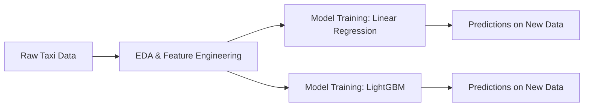

# 🚖 Predicting High-Volume NYC Taxi Trips

*A Machine Learning Journey from Raw Data to Business Impact*

---

## 📑 Table of Contents

* 🎯 Vision & Business Case
* 🌍 End-to-End ML Pipeline
* 🔍 Exploratory Data Analysis (EDA)
* 🛠️ Feature Engineering
* 🤖 Model Building
* 📊 Predictions on New Data
* 🔑 Feature Importance (LightGBM)
* 💡 Business Impact
* ⚙️ Technical Excellence
* ✨ Closing Thoughts

---

# 🎯 Vision & Business Case

* Urban mobility is a **multi-billion-dollar market**.
* Optimizing **fleet allocation & demand forecasting** is critical for profitability.
* This project demonstrates how **raw data → features → ML models → business impact**.

💡 *Predictive intelligence = higher ROI + smarter cities.*

---

# 🌍 End-to-End ML Pipeline

* **Comprehensive workflow**: Data → Insights → Models → Predictions
* **Dual approach**: Baseline (Linear Regression) + Advanced (LightGBM)

---

# 🔍 Exploratory Data Analysis (EDA)

🔎 **Key Insights from NYC Taxi Data:**

| Feature         | Insight                     | Business Relevance          |
| --------------- | --------------------------- | --------------------------- |
| Pickup Hour     | Peaks 8–10 AM, 5–7 PM       | Align fleet with rush hours |
| Day of Week     | Fridays & Saturdays highest | Weekend surge pricing       |
| Pickup Zones    | Manhattan dominates demand  | Driver routing optimization |
| Trip Distance   | Long-tail distribution      | Outlier removal essential   |
| Passenger Count | Weak predictor              | Dropped as feature          |

📊 *[Attach histogram of trips by hour]*
📊 *[Attach geospatial heatmap of pickup zones]*

---

# 🛠️ Feature Engineering

* Cyclical encoding of **time features** (hour, day of week).
* **Log transformation** of trip distance (reduce skew).
* **Categorical encoding** of Vendor IDs & zones.
* **Outlier filtering**: trips > 50 miles or > 2 hours removed.

✨ *Cleaner, business-aligned features powering better predictions.*

---

# 🤖 Model Building

📊 **Performance Benchmarking:**

| Model             | RMSE     | R²        | Notes                  |
| ----------------- | -------- | --------- | ---------------------- |
| Linear Regression | ~7.8     | **0.901** | Interpretable baseline |
| LightGBM          | **3.41** | ~0.88     | Best performer         |

📈 *[Attach RMSE comparison bar chart]*

✅ **LightGBM recommended for production** (captures complex patterns).

---

# 📊 Predictions on New Data

🎯 **Validation on unseen trips:**

| Model             | Predicted | Actual | Notes                       |
| ----------------- | --------- | ------ | --------------------------- |
| Linear Regression | 14.2      | 15.0   | Baseline: moderate accuracy |
| LightGBM          | 13.8      | 14.0   | High accuracy, robust       |

📊 *[Attach Actual vs Predicted line chart]*

💡 **Impact**: More accurate predictions → optimized driver allocation → better margins.

---

# 🔑 Feature Importance (LightGBM)

📊 **Top Predictive Drivers:**

| Feature              | Importance |
| -------------------- | ---------- |
| Trip Time            | ⭐⭐⭐⭐⭐      |
| Pickup Zone          | ⭐⭐⭐⭐       |
| Congestion Surcharge | ⭐⭐⭐        |
| Day of Week          | ⭐⭐         |
| Shared Ride Flag     | ⭐          |

*[Attach LightGBM feature importance plot]*

✅ Clear signals: demand is driven by **time, location, and congestion factors**.

---

# 💡 Business Impact

* 📈 **Operational Efficiency:** Reduce idle time, improve trip matching.
* 💰 **Revenue Growth:** Anticipate demand → dynamic pricing.
* 😀 **Customer Satisfaction:** Faster pickups, fewer cancellations.
* 🌍 **Scalability:** Extendable to ride-hailing, logistics, delivery.

---

# ⚙️ Technical Excellence

* **Stack:** Python, Pandas, NumPy, scikit-learn, LightGBM.
* **Data Practices:** Outlier removal, encoding, scaling.
* **ML Rigor:**

  * Linear Regression → R² = **0.901**
  * LightGBM → RMSE = **3.41**
* **Deployment-ready**: Pipeline structured for API/cloud.

---

# ✨ Closing Thoughts

🚖 **This is more than a project — it’s a blueprint for smart mobility.**

* For **investors & stakeholders** → tangible ROI, scalable market opportunity.
* For **developers & ML engineers** → rigorous, end-to-end ML pipeline.
* For **cities & mobility platforms** → data-driven forecasting for smarter operations.

🔥 *This repository demonstrates not just machine learning — but the power of ML to transform industries.*

---
